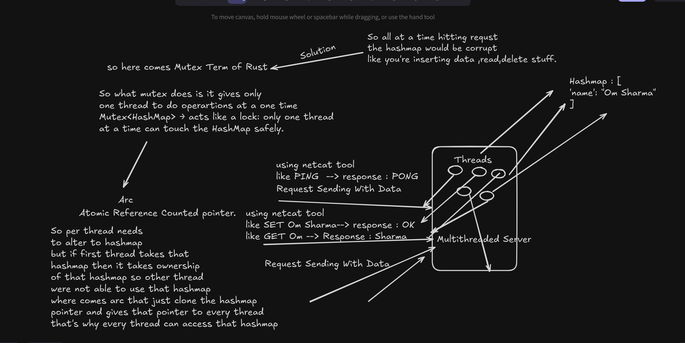

# RustisDB 🦀⚡

A Redis-like in-memory key-value store written in Rust.  
Fast, lightweight, and safe — built for learning and experimentation.

## Features
- [ X ] TCP server with RESP protocol
- [ X ] Basic GET/SET operations
- [ ] Pub/Sub channels
- [ ] Persistence (RDB / AOF style)
- [ ] Clustering support

## Why?
To understand how databases like Redis are built from the ground up,  
while taking advantage of Rust’s safety and performance guarantees.

# Architecuture.

